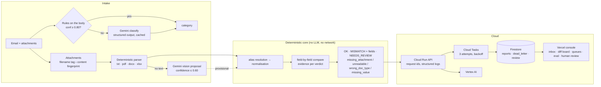

# ShipDoc

[](https://github.com/yk-chin/averis-sdoc/actions/workflows/ci.yml)

Averis × Monash Hackathon 2026 — shipping-document intake for a BPO documentation team.

**LLM proposes, the deterministic core disposes.** Gemini does what a model is good at — understanding an ambiguous email, reading a scanned page — and a pure, auditable core does what a verdict needs: normalise, compare, keep the evidence, escalate only what a person must see. The ablation below shows why that split is the better answer, not the cautious one.

An email arrives. ShipDoc classifies it, parses the attached Shipping Instruction (SI) and draft Bill of Lading (BL), compares the seven fields that matter, and escalates only what a person genuinely needs to look at — **without creating false alarms**.

**Live API:** https://shipdoc-api-705106212012.asia-southeast1.run.app (Cloud Run, Singapore; LLM via Vertex AI)
**Console:** https://averis-sdoc-k3ce.vercel.app — `web/`, Next.js on Vercel (inbox · diff report with raw → normalised view · exception / incomplete queues · eval dashboard)

## Results on the organiser's v2 dataset (520 emails)

| Axis | Score |
|---|---|
| final_score | **1.0000** |
| Email classification (macro-F1, 5 classes) | 1.0000 |
| Defect detection (F1) | 1.0000 |
| End-to-end (right email, right fields) | 1.0000 (46/46) |
| Escalation precision / recall | 1.000 / 1.000 (20 of 20) |

Precisely: these scores are **1.0 on the organiser's v2 dataset and on six semantics-preserving perturbations of it** (below). They are not a claim about unseen data; `docs/FINAL_ROUND_RISKS.md` lists what could break on different data.

Trajectory: 0.766 (rules only) → 0.890 (LLM fallback) → 0.891 (intent-aware escalation) → 1.000 (comparison fixes). See `evals/history.jsonl` and `evals/progress.png`.

Six semantics-preserving perturbations of the dataset (label synonyms, company-suffix spelling, weight units, UN/LOCODE vs port names, untagged attachment names) all score 1.000 after hardening — `docs/PERTURBATION_REPORT.md`.

## Is the hybrid a shortcut? The ablation says no

Same 520 emails, same black-box scorer (`scripts/ablation.py` → `evals/ablation.json`):

| configuration | final | macro-F1 | defect F1 | end-to-end | escalation precision |
|---|---|---|---|---|---|
| rules only (LLM and vision off) | 0.8433 | 0.478 | 1.000 | 1.000 | 1.000 |
| **LLM only** (Gemini classifies and compares from raw text) | 0.9257 | 1.000 | 0.900 | 0.891 | 0.171 |
| **hybrid (shipped)** | 1.0000 | 1.000 | 1.000 | 1.000 | 1.000 |

LLM-only classifies perfectly and *still* loses: it sends **111 of 220 comparisons** to a human (20 are genuine) — the false-alarm failure mode a BPO team cannot absorb. Rules alone cannot tell an invoice query from a general note. The deterministic core keeps the comparison at 1.0 under either front end; the LLM is what makes the front end right.

## How it works



Why a deterministic core: most teams hand the SI and BL to an LLM and ask "what differs". That is not reproducible, not auditable, and — measured above — over-escalates. Here the LLM classifies emails the rules are unsure about (55 % of this inbox) and reads scans the parser cannot (with its confidence capped below the review threshold, so it can inform a reviewer but never auto-pass); every comparison is a pure function with evidence (raw value, normalised value, reason, confidence) that can be explained line by line.

| Module | Role |
|---|---|
| `shipdoc_core/fields.json`, `fields.py` | The seven-field ontology as **configuration** (key, kind, aliases, near-miss traps such as Place of Receipt ≠ Port of Loading); an eighth field is one JSON entry, proven by `tests/test_ontology.py` |
| `shipdoc_core/normalize.py` | Company names (suffixes, "on behalf of"), ports (names + UN/LOCODE), counts, weights with unit conversion |
| `shipdoc_core/compare.py` | Deterministic comparator → `FieldResult` with evidence, `ComparisonReport` |
| `shipdoc_core/evaluate.py` | PRF, confusion, **confidence calibration (ECE)**, **cost-sensitive threshold optimisation** |
| `pipeline/classify.py` | Rule-based email classification (body only — subjects are deliberately misleading in the data) and the attachment-intent check |
| `pipeline/classify_llm.py` | Gemini fallback via `google-genai`: `LLM_PROVIDER=aistudio` (API key) or `vertex` (service-account ADC) |
| `pipeline/parse_doc.py`, `parse_office.py` | txt / pdf / docx / xlsx → "Label: Value" → fields |
| `pipeline/vision.py` | Gemini vision proposal for image-only PDFs (confidence capped at 0.60 < review threshold 0.62; corrupt files never uploaded) |
| `pipeline/run.py` | End-to-end pipeline → `submission.json` |
| `api/main.py`, `api/tasks.py`, `api/store.py` | FastAPI service; Cloud Tasks batch processing with 3 retries, a Firestore dead-letter queue and manual retry ("handle processing failures visibly and allow retries") |

Design invariants:
1. `compare.py` and `normalize.py` never import an LLM or network library.
2. When unsure → `UNDETERMINED` → a human. Never guess.
3. Formatting-only differences must be `NORMALIZED_MATCH`, never a mismatch.
4. Every verdict carries a reason and the before/after values.
5. A model output is a proposal: its confidence is capped below the review threshold, so it can never auto-pass.

## Why a mismatch costs money (the business case, to be sized with Averis at Workshop 2)

- **Consignee wrong on a negotiable (to-order) B/L** — the bill is the document of title; once issued and in circulation, cargo can be released against it to the wrong party. That is a title risk, not a delay.
- **Gross weight wrong** — the verified gross mass (SOLAS VGM) is a mandatory declaration; a wrong figure can mean the box is refused at the terminal, re-weighed, or rolled to the next sailing.
- **Any field differing from the letter of credit** — under UCP 600 a documentary discrepancy lets the issuing bank refuse the documents; the practical costs are a discrepancy fee per presentation and, worse, payment delayed for weeks while documents are corrected and re-presented.
- **Amending a B/L after issue** — carriers charge an amendment fee per correction and the correction may miss the documentation cut-off, so the shipment rolls over.

The subject lines in this inbox carry `LC`, `DP`, `CFR`, `OA` — payment terms and Incoterms. The system does not yet read them; when it does, an LC shipment with a mismatch is the one to escalate first. Indicative cost model and sensitivity: `docs/ROI.md`.

## Setup

```bash
python -m pip install -r requirements.txt pytest
cp .env.example .env          # add GEMINI_API_KEY for local runs (see comments in the file)
```

The organiser's dataset is **not** in this repository (`.gitignore`). Put the bundle's `inbox/` and `attachments/` under `./data/`:

```
data/
  inbox/          520 × *.json
  attachments/    250 files (txt / pdf / xlsx / docx)
```

## Run

```bash
python pipeline/run.py ./data submission.json      # pipeline → submission.json
python -m pytest tests/ -q                          # 78 tests
python -m uvicorn api.main:app --port 8090          # the API locally
```

## Console (`web/`)

A Next.js 15 app (no UI library; the same design tokens as the API's demo page, self-hosted Source Sans 3) that reads the Cloud Run API:

| Page | What it shows |
|---|---|
| `/` Inbox | The 520 processed emails from `GET /reports?prefix=email_`: category / status filters, search, status chips, attachment count, rule vs LLM |
| `/emails/{id}` Diff report | SI and draft BL side by side for the seven fields; hover (or the "Show normalisation" switch) reveals **raw → normalised** for every value plus the comparator's reason and confidence — formatting-only differences are `normalized`, never a mismatch |
| `/queues` | Two independent queues: **Exception queue** (`unreadable` / `wrong_doc_type` / `missing_value` — something arrived and could not be read, recognised or decided) and **Incomplete requests** (`missing_attachment` — nothing usable attached, chase the sender) |
| `/eval` | Scores, trajectory, per-class / confusion / field-level metrics, perturbations, and the three charts from `scripts/calibration.py` |

```bash
cd web && npm install && npm run dev        # http://localhost:3000, API_BASE in .env.local (defaults to the live API)
npm run sync-evals                           # copy evals/*.json|jsonl|png into web/public/evals
```

Browser calls go through a Next.js rewrite (`/api/*` → `API_BASE`), so the API needs no CORS. Deploy on Vercel with Root Directory `web` and the environment variable `API_BASE`.

The inbox data is the organiser's dataset loaded into our own Firestore with `scripts/load_cloud.py ./data --api <url>` (3 batches through `POST /batch`; the dataset itself never enters the repository).

## What we do not claim, and the evidence for it

- **Threats to validity.** The 1.0 was reached with 33 black-box scoring queries over 26 code versions against the *same* 520 emails. Aggregate-only feedback limits, but does not remove, adaptive-overfitting risk. Counter-measures: six semantics-preserving perturbations, Wilson intervals on every small sample (the field-level golden set is n = 11 emails / 15 defect fields — precision 1.0 has a 95 % interval of 0.80–1.00), and an independent hold-out set (below).
- **Independent hold-out** (`evals/holdout/`, 41 emails we authored with other company-suffix systems, ports outside our LOCODE table, label vocabularies outside our alias list, mixed-language labels, xlsx/docx, untagged files, 8 escalations; gold written before any run; never tuned on — `scripts/holdout_build.py`, `scripts/holdout_eval.py`):

| hold-out (our re-implementation of the four axes) | final | macro-F1 | defect F1 | end-to-end | escalation P / R |
|---|---|---|---|---|---|
| rules only | 0.6248 | 0.486 | 0.667 | 0.680 | 0.67 / 1.00 |
| **hybrid (shipped)** | **0.7416** | 0.953 | 0.667 | 0.680 (0.48–0.83) | 0.67 / 1.00 |

  The 9 misses are listed in `evals/holdout_result_llm.json`: company-suffix synonyms beyond our table (K.K. ↔ Kabushiki Kaisha), UN/LOCODEs outside our 45 codes when one side gives only the code, label abbreviations outside our alias list, and grey-zone parties routed to a person rather than called a mismatch. They are reported, not patched: patching them would turn the hold-out into a training set. They are the roadmap.
- **AI usage on the inbox**: rules decide 232 emails, Gemini 288 (55.4 %); vision proposals for the 6 scanned documents. Recorded per run in `evals/metrics_latest.json` (`ai_usage`).
- **Performance**: pipeline 7–10 ms per email in process; API p50 17 ms locally, ~200 req/s per core; Cloud Run p50 85–110 ms from Malaysia — `docs/PERFORMANCE.md`.

## Self-evaluation (black box)

We score ourselves against the organiser's Docker scoring service (`sdoc-hackathon-docker`, `docker compose up`) through its `POST /submit` endpoint:

```bash
python scripts/eval.py ./data --server http://localhost:8080
```

The script builds `submission.json`, posts it, and appends the returned scores to `evals/history.jsonl`. **We read only the aggregate scores** (`final_score`, `stage1_macro_f1`, `defect_f1`, `end_to_end`, `esc_precision`). We never read, parse, or copy `ground_truth.json`; the service keeps `REVEAL_GT` off and the ground truth is used server-side only. That is the black-box setup the organiser designed — we see the score, not the answers, so the system has to genuinely generalise.

Other evaluation scripts:

- `scripts/calibration.py` — reliability diagram + ECE, cost-sensitive threshold sweep, score progress (`evals/*.png`). The cost constants at the top are placeholders until Averis confirms real ratios.
- `scripts/perturb.py` — the perturbation tests (`docs/PERTURBATION_REPORT.md`).
- `scripts/ablation.py` — rules-only / LLM-only / hybrid on the organiser's scorer (`evals/ablation.json`).
- `scripts/holdout_build.py`, `scripts/holdout_eval.py` — the independent hold-out set and its scorer.
- `scripts/bench.py` — latency / throughput (`evals/bench.json`, `docs/PERFORMANCE.md`).

CI (`.github/workflows/ci.yml`): pyflakes + pytest (110 tests, rules only, no network) and the console's type-check + build on every push.

## API

| Endpoint | Auth | Description |
|---|---|---|
| `GET /` | — | Demo page (works on a phone) |
| `GET /static/*` | — | Self-hosted Source Sans 3 for the demo page (OFL 1.1) |
| `GET /health` | — | Liveness; `?deep=1` makes one real LLM call |
| `POST /process` | — (rate-limited per IP) | One email → `decision` + `evidence` (classification basis, parsed attachments, seven `FieldResult`s, readable report) |
| `POST /batch` | `X-API-Key` | Up to 200 emails, one Cloud Tasks task each (3 attempts, exponential backoff); duplicates by email_id + content hash are skipped |
| `GET /batch/{id}` | — | Per-email status of a batch |
| `GET /report/{id}` | — | Result by idempotency key or email_id (Firestore); includes the stored email header (`from`, `subject`, `body`, attachment names) |
| `GET /reports` | — | Slim rows for the console (decision + email header, never evidence or body); `?limit=&category=&status=&review_reason=&prefix=` |
| `GET /failures` | `X-API-Key` | Dead-letter queue: emails that failed all 3 attempts, with reason and original input |
| `POST /failures/{key}/retry` | `X-API-Key` | Retry a dead-lettered email |
| `POST /report/{id}/review` | review token or Google OIDC | Human-in-the-loop: `confirmed` or `corrected` (+ `corrected_fields`, `reviewer`, `reviewer_note`). Stores an audit trail (`original_ai_decision`, `human_decision`, `corrections`, `reviewed_at`, `reviewer`, `identity {method, verified}`) next to the report; with an OIDC bearer the reviewer is the token's verified email. The AI decision is never overwritten and `GET /report/{id}` returns `effective_decision`. The console's detail page has the Confirm / Correct buttons |

Request body: `{"email_id", "from", "subject", "body", "attachments": [{"name", "content_base64"} or {"name", "text"}]}`.

Auth is tiered by cost and sensitivity: single-email processing needs no credentials (10 requests / minute / IP); batch processing, the dead-letter queue (original inputs, tracebacks) and retries require `X-API-Key`; review takes a separate review-only token or an OIDC identity. Every request carries an `X-Request-Id` (honoured or minted, echoed, stored on the report, logged as one JSON line for Cloud Logging). Public responses mask sender addresses (`a***@domain`).

Deployment details, runtime identity, and the redeploy command: `docs/DEPLOY.md`.

## Future roadmap (not implemented)

- **Vision as more than a proposal.** Scans now get a Gemini vision proposal (confidence capped at 0.60) and a provisional comparison for the reviewer; the decision stays `unreadable`. Letting a proposal auto-pass would need a calibrated confidence on real scans, which we do not have yet.
- **LLM extraction fallback** for text documents the deterministic parser cannot structure (non-tabular layouts, free-text letters). Today: `unreadable` / `missing_value` escalation, never a guess.
- **The hold-out misses**: suffix synonyms beyond the table, UN/LOCODE lookups beyond 45 codes, abbreviation aliases, Incoterms / LC awareness for prioritisation.
- **Learned confidence calibration.** Extraction and verdict confidences are fixed per outcome kind; `scripts/calibration.py` measures them but nothing is fitted yet.
- **Firestore-transaction idempotency** across instances (today: idempotency key + status check, adequate at hackathon scale).

## Documents

- `docs/FINAL_ROUND_RISKS.md` — the dataset-shape assumptions behind each fix and what breaks if the final-round data differs
- `docs/PERTURBATION_REPORT.md` — perturbation tests before / after hardening
- `EVAL.md` — the evaluation loop
